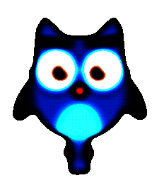
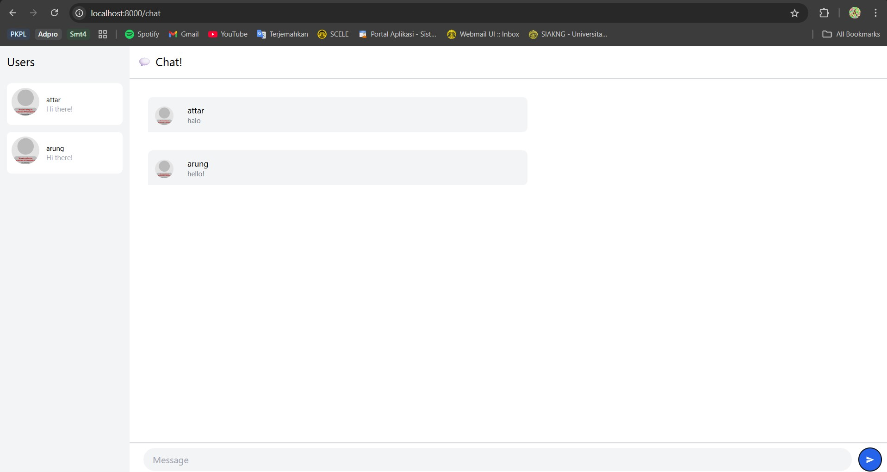
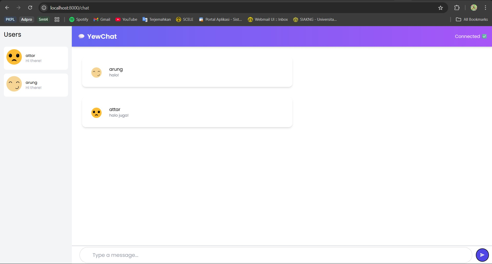

    <h1>MODULE 10 - WEBCHAT</h1>

    

    <h2>Alwie Attar Elfandra</h2>
    <h2>2306241726</h2>

__3.1. Original code__

    

Pada tutorial ini saya melakukan clone dari github SimpleWebSocket sebagai integrasi websocket dan YewChat sebagai frontend dari chat nya. Lalu tertampilah kata kata dari client client yang ada.

__3.2 . Add some creativities to the webclient__

    

Sebagai bentuk kreativitas, hal yang ingin saya tingkatkan adalah tampilan dari page chat-nya. Di sini saya mengubah beberapa warna, bubble chat, juga icon profile yang digunakan. Selain itu saya juga mengubah font textnya agar menjadi lebih menarik.